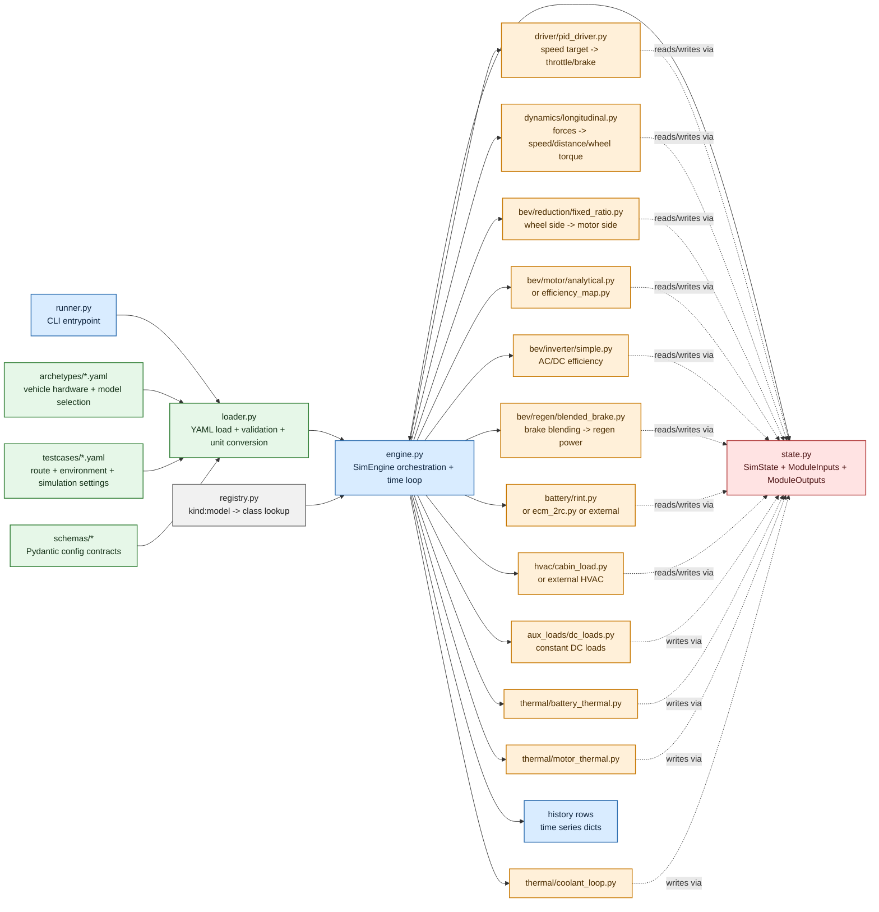

# VEHRON Codebase Map

This document is a visual map of the VEHRON codebase as it exists today.
It is intended to answer four questions at once:

- what the main layers of the software are
- what connects to what at runtime
- which code is active in the default BEV 4W path
- which code is present but currently optional, alternate, or scaffold-level

It is not a literal file tree dump. It is a systems map of responsibilities,
runtime data flow, and extension points.

## Colour Legend

- Blue: entrypoints and orchestration
- Green: configuration, schemas, and input data
- Orange: active runtime physics modules in the main BEV path
- Red: shared state and contracts
- Teal: extension or integration points
- Grey: present in repo but not the main active runtime path
- Purple: tests and validation safety net

## 1. Runtime Flow

### Runtime Reading Guide

- `runner.py` is the human-facing entrypoint.
- `loader.py` validates YAML and converts boundary units before simulation starts.
- `registry.py` resolves model names like `motor:analytical` into Python classes.
- `engine.py` is the conductor: it builds modules, executes them in order, handles multi-rate scheduling, and writes outputs back into shared state.
- `state.py` is the central bus. Modules do not directly call each other. They communicate through `SimState`.
- The active default path today is BEV-focused and includes driver, longitudinal dynamics, reducer, motor, inverter, regen, battery, HVAC, aux loads, and thermal trend models.

## 2. Repository Mind Map

```mermaid
flowchart TD

    Repo["VEHRON repository"]:::entry

    Core["src/vehron/<br/>core runtime"]:::entry
    Docs["docs/<br/>technical docs + examples"]:::config
    Data["data/<br/>lookup and map files"]:::config
    Cases["src/vehron/archetypes + testcases<br/>vehicle and mission inputs"]:::config
    Tests["tests/<br/>unit + integration checks"]:::test

    Repo --> Core
    Repo --> Docs
    Repo --> Data
    Repo --> Cases
    Repo --> Tests

    Core --> Entrypoints["runner.py<br/>CLI"]:::entry
    Core --> EngineState["engine.py + state.py<br/>orchestration + shared bus"]:::state
    Core --> Loading["loader.py + schemas/<br/>validation boundary"]:::config
    Core --> RegistryNode["registry.py<br/>module resolution"]:::core
    Core --> Modules["modules/<br/>physics and subsystem models"]:::active
    Core --> Post["post/<br/>reporting placeholders"]:::inactive

    Modules --> DriverFam["driver/<br/>PID driver active<br/>pedal_map present"]:::active
    Modules --> DynamicsFam["dynamics/<br/>longitudinal active<br/>aero grade rolling_resistance helpers<br/>pacejka present"]:::active
    Modules --> BevFam["powertrain/bev/<br/>reduction motor inverter regen"]:::active
    Modules --> BatteryFam["energy_storage/battery/<br/>base rint ecm_2rc active<br/>pybamm_wrap present"]:::active
    Modules --> HVACFam["hvac/<br/>base + cabin_load active<br/>heat_pump present"]:::active
    Modules --> AuxFam["aux_loads/<br/>dc_loads active"]:::active
    Modules --> ThermalFam["thermal/<br/>battery motor coolant active<br/>ice_thermal present"]:::active
    Modules --> OtherPT["powertrain/ice hybrid fcev/<br/>scaffold or future-facing files"]:::inactive
    Modules --> Supercap["energy_storage/supercap.py<br/>present but not wired to default path"]:::inactive

    Cases --> VehicleSet["archetypes/<br/>bev_car_sedan active example<br/>others mostly placeholders"]:::config
    Cases --> TestcaseSet["testcases/<br/>flat highway WLTP city ghat ambient variants"]:::config

    Data --> DriveCycles["drive_cycles/*.csv<br/>used by drive_cycle route mode"]:::config
    Data --> MotorMap["motor_maps/pmsm_160kw.csv<br/>used only by efficiency_map motor path"]:::ext
    Data --> OtherMaps["engine_maps + fuel_cell_curves<br/>present for broader future scope"]:::inactive

    Tests --> Unit["unit tests<br/>loader registry battery motor hvac reducer etc."]:::test
    Tests --> Integration["integration tests<br/>end-to-end BEV and energy balance runs"]:::test

    Post --> PostPlaceholders["reports timeseries energy_audit dashboard<br/>currently scaffold placeholders"]:::inactive

    classDef entry fill:#d9ecff,stroke:#2f6fb0,color:#10263f,stroke-width:1.5px;
    classDef config fill:#e6f7e8,stroke:#2e7d32,color:#133016,stroke-width:1.5px;
    classDef active fill:#fff0d9,stroke:#c77700,color:#4d2e00,stroke-width:1.5px;
    classDef state fill:#ffe3e3,stroke:#b23b3b,color:#4b1111,stroke-width:1.5px;
    classDef ext fill:#dff8f4,stroke:#147a6c,color:#0f3a34,stroke-width:1.5px;
    classDef inactive fill:#ededed,stroke:#7a7a7a,color:#222,stroke-width:1.5px;
    classDef core fill:#f7f7f7,stroke:#666,color:#222,stroke-width:1.5px;
    classDef test fill:#f0e3ff,stroke:#7a42b6,color:#2e144d,stroke-width:1.5px;
```

## 3. What Connects To What

### Control and motion path

- `target_v_ms` is set from testcase route logic in `engine.py`.
- `driver/pid_driver.py` converts target speed error into `throttle` and `brake`.
- `dynamics/longitudinal.py` converts those pedal commands into force, acceleration, speed, distance, and wheel torque.
- `bev/reduction/fixed_ratio.py` converts wheel-side torque and speed into motor-side torque and speed.
- `bev/motor/*` converts motor operating point into motor efficiency and traction electrical power.
- `bev/inverter/simple.py` turns motor-side electrical demand into DC-side demand.

### Energy path

- `regen/blended_brake.py` converts braking opportunity into `p_regen_w`.
- `hvac/cabin_load.py` contributes `p_hvac_w`.
- `aux_loads/dc_loads.py` contributes `p_aux_w`.
- `battery/*` combines traction, HVAC, aux, regen, and optional external charging into `soc`, `v_batt_v`, `i_batt_a`, and `p_batt_w`.

### Thermal path

- `battery_thermal.py` reacts mainly to battery current and ambient temperature.
- `motor_thermal.py` reacts mainly to motor torque, speed, efficiency, and ambient temperature.
- `coolant_loop.py` slowly equalizes battery and motor temperatures through a simple coolant state.
- `hvac/cabin_load.py` also evolves `t_cabin_k`, so cabin thermal behavior sits partly inside the HVAC subsystem.

### Extension path

- `registry.py` can load external battery and HVAC classes if the YAML selects `model: external`.
- `motor/efficiency_map.py` can consume `data/motor_maps/pmsm_160kw.csv`, but only if the vehicle motor model is switched from `analytical` to `efficiency_map`.

## 4. Active vs Present

This is one of the most important truths about this repo:

- The default validated path is the BEV 4W simulation loop centered on `bev_car_sedan.yaml`.
- Some files are active helpers in that loop but are not individually instantiated from YAML, such as `dynamics/aero.py` and `dynamics/grade.py` being conceptually represented while the active runtime logic is concentrated in `dynamics/longitudinal.py`.
- Some files are alternate implementations, such as `motor/efficiency_map.py` and `battery/ecm_2rc.py`.
- Some files are extension contracts, such as battery and HVAC base classes plus external loading support.
- Some files are scaffolds or placeholders for future capability, such as parts of `post/`, `powertrain/ice/`, `powertrain/hybrid/`, and `powertrain/fcev/`.

## 5. If You Want A Deeper Visual Next

This document is the best "high signal" architectural map for the current repo.
If you want, the next step can be one of these:

1. A clickable HTML system map with hover tooltips and stronger layout control.
2. A more detailed file-to-file dependency graph for every Python file.
3. A runtime sequence diagram showing exact module order and data exchanged each tick.
4. A cleaned-up "implemented vs planned" map suitable for investors, collaborators, or a website.

Each serves a different purpose. This document is optimized for engineering orientation.
