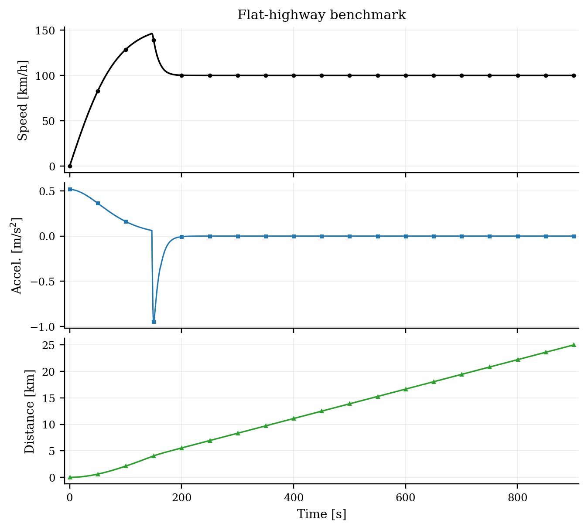
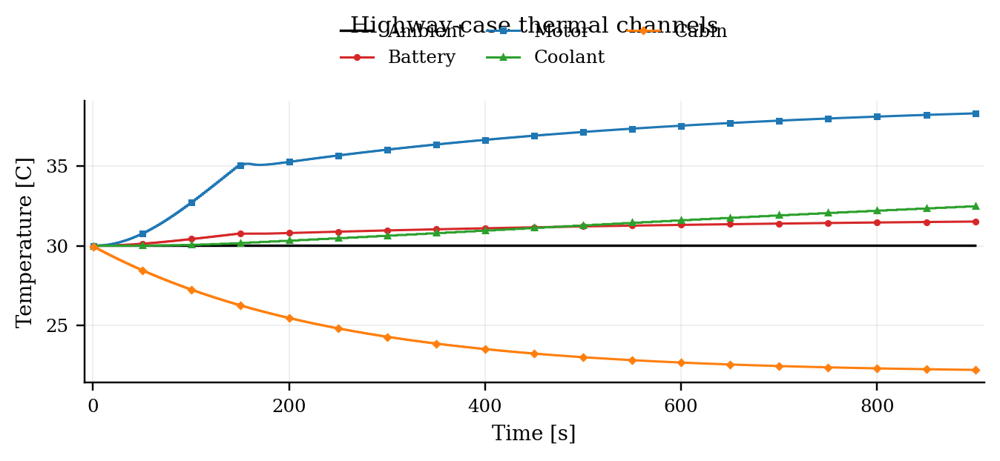
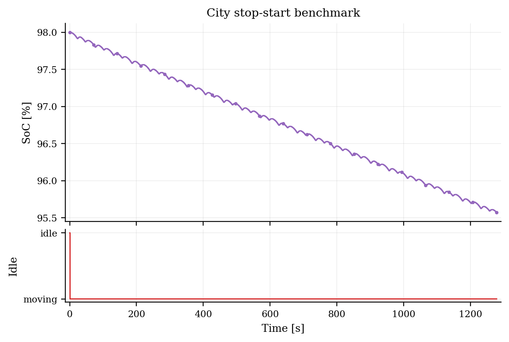

# Summary

VEHRON, short for VEHicle Research \& Optimisation Network, is an open-source
Python framework for forward-time road-vehicle simulation with an active focus
on battery-electric passenger vehicles. Here, "network" refers to a network of
people and collaborating research work, not a neural-network model class. The
software is organized around a small orchestration core, a shared state bus,
validated YAML configuration, and interchangeable subsystem modules for driver,
longitudinal dynamics, drivetrain reduction, electric motor, inverter,
regenerative braking, battery, HVAC, auxiliary loads, and low-order thermal
trends.

The current repository is intentionally narrow. VEHRON v1 should be understood
as a BEV-focused research software package, not as a general multi-powertrain
vehicle platform. The supported path today is CLI-driven, YAML-configured,
forward-time longitudinal simulation for battery-electric vehicles using either
parametric routes or drive-cycle CSV input in the public `time_s,speed_kmh`
format. The software writes reproducible case packages including summary
metadata, time series, copied and resolved inputs, and standard plots.

VEHRON is designed to be reusable within that bounded scope. It includes
reference in-repo battery and HVAC models, YAML-configured auxiliary electrical
loads, and documented slots for loading custom battery or HVAC models from
external Python files at runtime. This lets teams keep proprietary subsystem
models outside the public repository while still running them inside a
transparent vehicle-level simulation loop.

# Statement of Need

Vehicle-simulation workflows often fall into an unhelpful middle ground.
High-fidelity commercial tools can be expensive, opaque, or difficult to
automate, while one-off notebooks and lab scripts rarely mature into reusable
research software. Researchers working on battery-electric vehicle studies
often need something in between: a simulation stack that is transparent,
scriptable, modular, and good enough to support repeatable engineering studies
without claiming unrealistic fidelity.

VEHRON targets that use case. It is intended for:

- early-stage BEV sizing and trade studies
- duty-cycle comparison under different operating conditions
- generation of battery stress histories for later downstream analysis
- subsystem sensitivity checks around battery, HVAC, and auxiliary electrical
  loads
- integration of private battery or HVAC models into an otherwise open vehicle
  simulation workflow

The final point is especially important for this project. VEHRON is being
developed alongside a broader research direction involving battery degradation
analysis, but VehRON itself is not a degradation-inference package. Its role is
to stand on its own as reusable research software for generating vehicle-level
and battery-relevant simulation histories under configurable missions.

# Software Architecture

The VEHRON architecture follows a small set of explicit design rules. First,
`SimEngine` owns orchestration and time stepping only; it does not carry
subsystem physics internally. Second, `SimState` acts as the shared state bus
between modules. Third, each module owns a bounded physical domain and returns
only the outputs it computes. Fourth, vehicle hardware and mission definitions
are provided through validated YAML configuration rather than runtime code.

At a high level, one run proceeds as follows:

1. Vehicle and testcase YAML files are loaded and validated.
2. Boundary-unit conversions are applied at the loader edge.
3. `SimEngine` instantiates the configured subsystem modules.
4. The engine advances a fixed master clock and schedules modules according to
   their execution divisors.
5. Module outputs are written back onto `SimState`.
6. Energy bookkeeping, logging, and termination checks are applied.
7. A flat time series and case package are emitted for post-processing.

The present runtime uses fixed-step multi-rate execution. If the master
timestep is $\Delta t$ and a module declares a divisor $d$, its effective
update interval is:

$$
\Delta t_{\mathrm{eff}} = d \, \Delta t
$$

Fast domains such as the driver, longitudinal dynamics, motor, inverter, and
regenerative braking run every master step in the active BEV chain, while
slower domains such as battery electrical updates, HVAC, and thermal trends run
less often. To reduce the distortion that would come from sampling slow modules
on a single instantaneous input, VEHRON accumulates intermediate signals across
master steps and flushes the accumulator immediately before the slower module is
stepped.

# Implemented Models

The supported BEV path currently includes a PID driver, longitudinal vehicle
dynamics, fixed-ratio reduction, motor and inverter models, blended
regenerative braking, in-repo battery models (`rint` and `ecm_2rc`), auxiliary
electrical loads, a low-order cabin HVAC model, and low-order battery, motor,
and coolant thermal trend models. This section states the implemented model
forms directly so the software paper reflects the actual runtime behavior.

## Driver

The active driver is a PID speed-tracking controller. With target speed
$v_\mathrm{target}$ and actual speed $v$, the tracking error is

$$
e(t) = v_\mathrm{target}(t) - v(t)
$$

and the controller command is

$$
u(t) = K_p e(t) + K_i \int e(t)\,dt + K_d \frac{de(t)}{dt}.
$$

VEHRON then splits this command into non-negative throttle and brake commands
by clamping positive and negative branches separately:

$$
\mathrm{throttle} = \mathrm{clip}(u, 0, 1), \qquad
\mathrm{brake} = \mathrm{clip}(-u, 0, 1).
$$

## Longitudinal Dynamics

The longitudinal vehicle model resolves traction, braking, aerodynamic drag,
rolling resistance, and road grade. The net force is

$$
F_{\mathrm{net}} =
F_{\mathrm{trac}} - F_{\mathrm{brake}} - F_{\mathrm{aero}} - F_{\mathrm{roll}} - F_{\mathrm{grade}}
$$

with acceleration:

$$
a = \frac{F_{\mathrm{net}}}{m}
$$

with kinematic updates

$$
v_{k+1} = \max(v_k + a_k \Delta t, 0), \qquad
x_{k+1} = x_k + \frac{v_k + v_{k+1}}{2}\Delta t.
$$

The implemented road-load terms are

$$
F_{\mathrm{aero}} =
\frac{1}{2}\rho C_d A v_\mathrm{rel}^2
$$

$$
F_{\mathrm{roll}} =
m g C_{rr}\cos(\theta)\left(1 + 0.01 v\right)
$$

$$
F_{\mathrm{grade}} = m g \sin(\theta)
$$

with traction and braking forces scaled from normalized pedal commands.

## Reducer, Motor, and Inverter

The reducer maps wheel-side quantities to the motor shaft through a fixed total
ratio

$$
r_\mathrm{tot} = r_\mathrm{primary}\,r_\mathrm{secondary}.
$$

Wheel speed and motor speed are related by

$$
\omega_\mathrm{wheel} = \frac{v}{r_\mathrm{wheel}}, \qquad
\omega_\mathrm{motor} = r_\mathrm{tot}\,\omega_\mathrm{wheel}.
$$

For positive wheel torque, VEHRON applies gearbox efficiency in the forward
direction, while regenerative torque uses the reverse-direction form currently
implemented in the reducer module.

The default analytical motor model clamps torque and mechanical power to the
configured limits,

$$
P_\mathrm{mech} = T_\mathrm{motor}\,\omega_\mathrm{motor},
$$

and estimates motor efficiency from load and speed fractions:

$$
\eta_\mathrm{motor} =
\mathrm{clip}\left(\eta_\mathrm{base} - 0.06(1-\lambda_T) - 0.03\lambda_\omega,\;0.7,\;0.98\right)
$$

where $\lambda_T$ and $\lambda_\omega$ are the normalized torque and speed
fractions. For positive motoring power, the electrical demand is

$$
P_\mathrm{drive} = \frac{P_\mathrm{mech}}{\eta_\mathrm{motor}}.
$$

The inverter then applies a fixed efficiency:

$$
P_\mathrm{drive,dc} = \frac{P_\mathrm{drive}}{\eta_\mathrm{inv}}
$$

for positive traction power.

The map-based motor variant reuses the analytical motor structure and replaces
the analytical efficiency estimate with nearest-neighbor efficiency lookup from
a CSV efficiency map.

## Regenerative Braking

The current blended braking model computes a requested regenerative power

$$
P_\mathrm{regen,req} = \mathrm{brake}\cdot P_\mathrm{regen,max}
$$

and limits it by the wheel-side kinetic opportunity:

$$
P_\mathrm{regen} =
\eta_\mathrm{regen}\,\min\left(P_\mathrm{regen,req}, \max(-P_\mathrm{wheel}, 0)\right).
$$

Regen is disabled at very low speed, when braking is not requested, or when the
battery SoC is already near the hard upper limit used by the runtime.

## Battery Models

The baseline `rint` battery model resolves the net battery-side power demand as
traction plus HVAC plus auxiliaries minus regenerative recovery and any
configured external charging contribution. Using nominal voltage
$V_\mathrm{nom}$, the ideal current is

$$
I_\mathrm{ideal} = \frac{P_\mathrm{net}}{V_\mathrm{nom}}
$$

which is then clamped by charge and discharge C-rate limits. Terminal voltage
is

$$
V_\mathrm{batt} = V_\mathrm{nom} - I_\mathrm{batt}R_\mathrm{int}
$$

and SoC integration is

$$
\mathrm{SoC}_{k+1} = \mathrm{clip}\left(\mathrm{SoC}_k -
\frac{I_\mathrm{batt}\Delta t}{Q_\mathrm{Ah}\,3600},
\mathrm{SoC}_\mathrm{min},
\mathrm{SoC}_\mathrm{max}\right).
$$

The higher-fidelity equivalent-circuit battery implementation includes a two-RC
ECM family [@hu2012ecm; @su2019ecm], with terminal voltage represented as

$$
V_{\mathrm{term}} = V_{\mathrm{ocv}} - I R_0 - V_{\mathrm{rc1}} - V_{\mathrm{rc2}}
$$

where $V_\mathrm{ocv}$ is a shaped open-circuit-voltage estimate from SoC. Each
RC branch evolves using the exponential discrete-time update implemented in the
code:

$$
V_{\mathrm{rc},i}^{k+1} =
\alpha_i V_{\mathrm{rc},i}^{k} +
(1-\alpha_i) I_k R_i,
\qquad
\alpha_i = \exp\left(-\frac{\Delta t}{R_i C_i}\right).
$$

The ECM therefore adds transient sag and recovery behavior while remaining fast
enough for vehicle-level simulation.

## Auxiliary Electrical Loads

The present auxiliary-load model is intentionally simple. It sums configured
electrical parasitics:

$$
P_\mathrm{aux} =
P_\mathrm{headlights} +
P_\mathrm{adas} +
P_\mathrm{infotainment} +
P_\mathrm{steering}.
$$

This gives users a documented and reproducible way to vary auxiliary demand
through YAML configuration, even though the current implementation is
parameter-based rather than a richer plugin-style parasitics framework.

## Cabin HVAC and Cabin Thermal Model

The cabin HVAC model follows the low-order vehicle-cabin thermal-model family
used in comparative energy studies [@marcos2014cabin; @torregrosa2015cabin;
@noreen2019thermal; @cabreview2024]. The cabin is treated as a single lumped
thermal mass, with passive and active heat terms combined as

$$
Q_\mathrm{passive} =
Q_\mathrm{envelope} +
Q_\mathrm{solar} +
Q_\mathrm{ventilation} +
Q_\mathrm{occupants}
$$

and net cabin heat

$$
Q_\mathrm{net} = Q_\mathrm{passive} + Q_\mathrm{hvac}.
$$

The implemented terms are

$$
Q_\mathrm{envelope} = UA_\mathrm{tot}(T_\mathrm{amb} - T_\mathrm{cabin})
$$

$$
UA_\mathrm{tot} = UA_\mathrm{body} + k_v v
$$

$$
Q_\mathrm{solar} = G_\mathrm{solar} A_\mathrm{glass}\tau_\mathrm{solar}
$$

$$
Q_\mathrm{ventilation} = \dot{m}_\mathrm{air} c_p (T_\mathrm{amb} - T_\mathrm{cabin})
$$

$$
Q_\mathrm{occupants} = N_\mathrm{occ} q_\mathrm{occ}
$$

and cabin temperature evolves as

$$
T_{\mathrm{cabin},k+1} =
T_{\mathrm{cabin},k} + \frac{Q_\mathrm{net}\Delta t}{C_\mathrm{tot}}.
$$

Cooling and heating thermal requests are clipped by the rated HVAC thermal
power. Electrical HVAC demand is then computed from the relevant coefficient of
performance:

$$
P_\mathrm{hvac} =
\begin{cases}
\frac{|Q_\mathrm{hvac}|}{\mathrm{COP}_\mathrm{cooling}}, & Q_\mathrm{hvac}<0 \\
\frac{Q_\mathrm{hvac}}{\mathrm{COP}_\mathrm{heating}}, & Q_\mathrm{hvac}>0 \\
0, & Q_\mathrm{hvac}=0
\end{cases}
$$

## Thermal Trend Models

VEHRON currently uses three low-order thermal trend models in the active BEV
path.

The battery thermal model applies first-order ambient relaxation plus a
current-dependent loss term:

$$
T_{\mathrm{batt},k+1} =
T_{\mathrm{batt},k} +
\frac{T_\mathrm{amb}-T_\mathrm{batt}}{\tau_\mathrm{batt}}\Delta t +
\beta_\mathrm{batt} Q_\mathrm{loss}\Delta t
$$

with

$$
Q_\mathrm{loss} = 3|I_\mathrm{batt}|.
$$

The motor thermal model uses the same first-order structure with loss power
derived from shaft power and motor inefficiency:

$$
Q_{\mathrm{loss,motor}} =
|T_\mathrm{motor}\omega_\mathrm{motor}|(1-\eta_\mathrm{motor})
$$

$$
T_{\mathrm{motor},k+1} =
T_{\mathrm{motor},k} +
\frac{T_\mathrm{amb}-T_\mathrm{motor}}{\tau_\mathrm{motor}}\Delta t +
\beta_\mathrm{motor} Q_{\mathrm{loss,motor}}\Delta t.
$$

The coolant loop simply relaxes toward the mean of the battery and motor
temperatures:

$$
T_\mathrm{target} = \frac{T_\mathrm{batt} + T_\mathrm{motor}}{2}
$$

$$
T_{\mathrm{coolant},k+1} =
T_{\mathrm{coolant},k} +
\frac{T_\mathrm{target} - T_\mathrm{coolant}}{\tau_\mathrm{coolant}}\Delta t.
$$

# Example Workflows

The current public workflow is CLI-first. A user can install VEHRON, run a
baseline BEV case, inspect the generated case package, and then move on to
custom drive-cycle or external-model studies. The repository now includes:

- documented public CLI usage
- a getting-started guide
- runnable custom drive-cycle examples using `time_s,speed_kmh` CSV input
- an external battery-slot example
- an external HVAC slot contract and template
- YAML-configured auxiliary electrical parasitics through `aux_loads`
- packaged example resources accessible through `vehron list-examples` and
  `vehron run-example`

Two current software regression benchmarks illustrate the supported path:

- a flat-highway BEV sedan case covering about 25 km with final SoC near 0.887
  and net energy use near 5104 Wh
- a stop-start city cycle covering about 8 km with final SoC near 0.956 and
  visibly larger regenerative recovery

These benchmarks are useful as software regression references, not as proof of
broad physical validation.

Figure 1 shows the motion channels from the flat-highway BEV case, while Figure
2 shows temperature channels from the same case. Figure 3 shows the SoC and
idle-state view for the city cycle.

# Reuse and Extensibility

VEHRON is structured as a reusable research kernel within a deliberately narrow
scope. Outsiders can:

- define a new BEV using YAML configuration
- run a new duty cycle using a simple `time_s,speed_kmh` CSV speed trace
- swap in a custom battery model through the external battery slot using a
  local Python file
- swap in a custom HVAC model through the external HVAC slot using a local
  Python file
- change auxiliary electrical parasitics through YAML `aux_loads` parameters
- inspect reproducible case-package outputs for downstream analysis

The public reuse story is intentionally bounded. VEHRON should not currently be
presented as:

- a broad multi-powertrain simulation platform
- a GPS or latitude/longitude route replay framework
- a degradation-inference package
- a fully validated production-grade digital twin

That boundary matters to the software contribution. VEHRON's claim is not
maximum physical fidelity. Its contribution is a reusable, inspectable, and
modular BEV research simulation framework with a documented public interface.

# Quality and Validation Status

The repository includes unit and integration tests for the active public
workflow, including:

- CLI run behavior
- case-package output generation
- packaged-resource resolution
- documented example runs
- benchmark regression ranges for the active BEV path

The current validation boundary is software verification plus low-order model
documentation, not broad real-world vehicle validation. VEHRON should therefore
be understood as reusable research software infrastructure for BEV simulation,
not as a validated predictive platform across many vehicle classes and
conditions.

# Availability

VEHRON is distributed as Python source under the AGPL-3.0-only license in this
repository. The codebase includes runnable examples, tests, public interface
documentation, and a companion LaTeX manuscript in `paper/` that records a
longer-form software paper draft.

# Acknowledgements

The project reflects sustained independent engineering effort toward an open,
modular vehicle-simulation stack that can host both in-repo and externally
supplied subsystem models.
